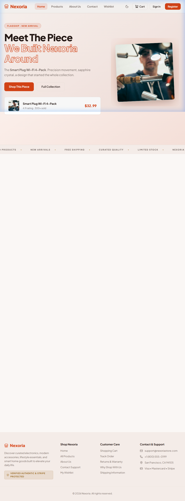
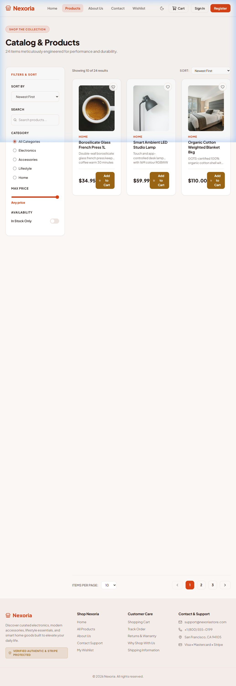
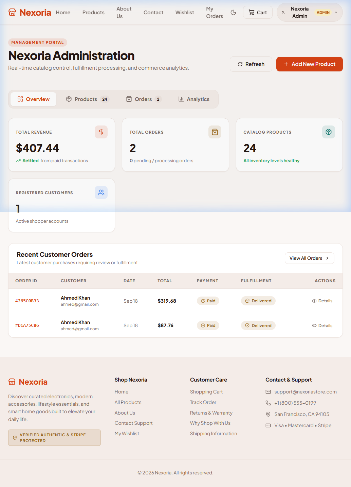
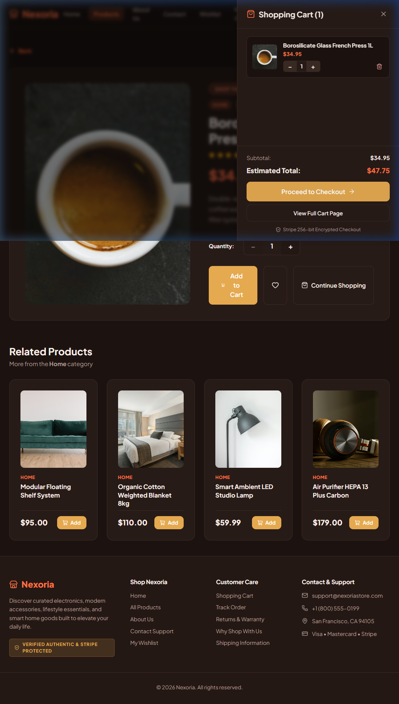
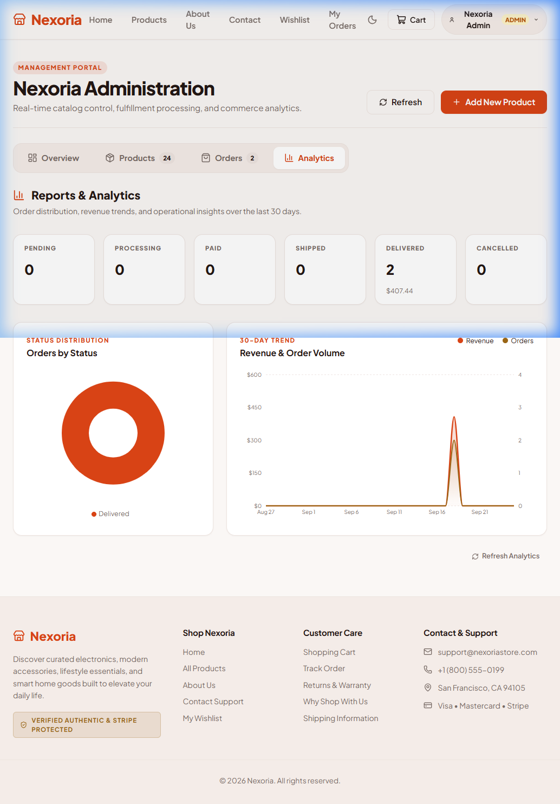
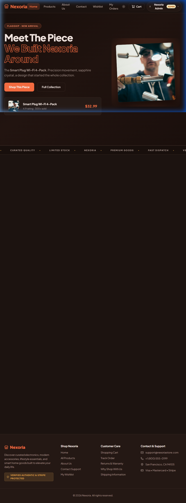

# Nexoria

> A full-stack e-commerce store built with the MERN stack.

> [!NOTE]
> CodeAlpha Internship - Task 1 (Full Stack E-Commerce Store)

Nexoria is a premium e-commerce web application featuring a flagship-product editorial homepage, a full product catalog with search, filtering and sorting, a persistent shopping cart, Stripe-powered checkout, and a complete admin dashboard with reports and analytics. It supports dark and light mode and is fully responsive.

---


---

## Live Demo

> [Nexoria E-commerce store](https://codealpha-nexoria.vercel.app/).

---

## Features

- JWT authentication with role-based access (user / admin)
- Product catalog with search, category filter, price range, stock toggle, and sort (newest, price low-to-high, price high-to-low)
- Persistent shopping cart scoped per user (localStorage, guest cart merges on login)
- Stripe test-mode checkout with PaymentIntent flow
- Order history with PDF invoice download (jsPDF)
- Wishlist saved to localStorage
- Admin dashboard: product CRUD, order fulfillment status updates, analytics tab with pie chart (order status) and 30-day revenue/volume area chart
- Dark mode / light mode toggle (CSS custom properties, no Flash of Unstyled Content)
- Fully responsive layout with mobile filter drawer and collapsible navigation

---

## Screenshots

| Homepage | Products | Admin Dashboard |
|---|---|---|
|  |  |  |

| Cart | Admin Analytics | Dark Mode |
|---|---|---|
|  |  |  |

---

## Tech Stack

**Frontend**
- React 18 + React Router v6
- Vite (build tooling)
- Vanilla CSS with custom property design tokens (rust/terracotta palette)
- Tailwind CSS v4 (utilities layer only, no preflight)
- Recharts (admin analytics charts)
- Axios with JWT interceptor
- jsPDF + jspdf-autotable (PDF invoices)

**Backend**
- Node.js + Express
- MongoDB Atlas + Mongoose ODM
- JWT authentication (jsonwebtoken + bcryptjs)
- Stripe SDK (PaymentIntent)
- Nodemailer (contact form)

---

## Project Structure

```
Nexoria/
├── client/                  # React frontend (Vite)
│   ├── src/
│   │   ├── components/      # Navbar, CartDrawer, Modals, Toast
│   │   ├── context/         # AuthContext, CartContext, ToastContext
│   │   ├── pages/           # All route pages
│   │   ├── services/        # Axios instance
│   │   └── index.css        # Full design system
│   └── index.html
└── server/                  # Express API
    ├── config/              # MongoDB connection
    ├── controllers/         # Route logic
    ├── middleware/          # Auth, error handling
    ├── models/              # Mongoose schemas
    ├── routes/              # Express routers
    └── server.js
```

---

## Running Locally

**Prerequisites:** Node.js 18+, MongoDB Atlas URI, Stripe test keys.

**Backend**

```bash
cd server
cp .env.example .env        # fill in MONGO_URI, JWT_SECRET, STRIPE_SECRET_KEY
npm install
npm start                   # runs on http://localhost:5000
```

**Frontend**

```bash
cd client
npm install
npm run dev                 # runs on http://localhost:5173
```


Part of a 3-project internship submission for CodeAlpha.
